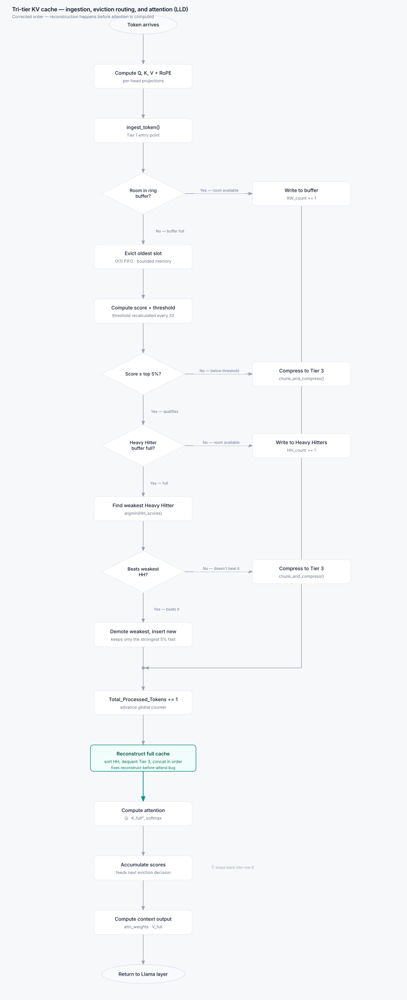

# TriTierCache: Hierarchical Memory-Compressed KV Cache

[](https://www.python.org/)
[](https://pytorch.org/)
[](https://github.com/huggingface/transformers)
[](LICENSE)

An optimized, multi-tier Key-Value (KV) cache architecture designed for long-context autoregressive LLM inference (specifically tailored for LLaMA architectures). **TriTierCache** drastically reduces the KV cache memory footprint during long-sequence generation while maintaining generation accuracy and low latency.

---

## Architecture Overview

Standard full-precision KV caches grow linearly with context length ($O(N)$), quickly exceeding GPU memory limits during long auto-regressive generation. TriTierCache introduces a **three-tier hierarchical storage strategy with attention sinks**, categorizing tokens based on recency and cumulative attention importance.


### The Storage Hierarchy

| Tier / Buffer | Data Representation | Sizing & Allocation | Purpose & Policy |
| :--- | :--- | :--- | :--- |
| **Attention Sinks** | FP32 (Exact) | Fixed `SINK_SIZE = 4` | Retains initial sequence tokens to preserve attention distribution stability (StreamingLLM). |
| **Tier 1: Recent Window (RW)** | FP32 (Exact) | Fixed `R_size` (e.g., 256 tokens) | Ring buffer storing the latest tokens in full precision for exact local context. FIFO eviction. |
| **Tier 2: Heavy Hitters (HH)** | FP32 (Exact) | Dynamic `H_ratio` (e.g., top 5% of `max_seq_len`) | Stores the most critical historical tokens with the highest cumulative attention scores. Dynamically demoted when stronger tokens arrive. |
| **Tier 3: Background Storage (PBS)** | 2-bit Quantized (Packed `int32`) | Remaining token capacity (`max_background_tokens`) | KIVI-style asymmetric 2-bit quantization for background tokens. Staged via a 16-token Waiting Room (`WR`). |

---

## Detailed Pipeline & Token Lifecycle



### 1. Ingestion & FIFO Eviction
- Incoming tokens ($K, V$) are first placed into the **Attention Sink** buffer until full (`SINK_SIZE = 4`).
- Subsequent tokens populate the **Recent Window ring buffer** (`RW_K_Buffer`, `RW_V_Buffer`).
- When the ring buffer reaches capacity, the oldest token at `RW_head_index` is evicted and passed to the eviction router.

### 2. Eviction Routing & Heavy Hitter Management
- Attention scores are tracked globally in `Global_Attn_Scr`.
- A 95th-percentile attention score threshold is recalculated dynamically every `UPDATE_THRESHOLD = 32` tokens via `torch.quantile`.
- **Routing Decision**:
  - **Score $\ge$ Threshold**: 
    - If Tier 2 (Heavy Hitters) has capacity, the token is added directly.
    - If Tier 2 is full, the token's score is compared against the weakest Heavy Hitter (`argmin(HH_scores)`). If it beats the weakest HH, the weakest token is demoted to Tier 3 via `compress_and_store()` and replaced by the new token.
  - **Score $<$ Threshold**: Routed directly to Tier 3 via `compress_and_store()`.

### 3. Asymmetric 2-bit Quantization (KIVI-Style)
Tokens demoted or routed to Tier 3 enter an intermediate 16-token **Waiting Room** (`WR`). Once `CHUNK_SIZE = 16` tokens accumulate:
- **Key ($K$) Quantization**: Quantized **per-channel** across the 16 tokens in the chunk. 16 2-bit values are packed into a single `int32` per channel. Block-level scales and zero-points are preserved.
- **Value ($V$) Quantization**: Quantized **per-token** across head channels. 16 2-bit values are packed into a single `int32` per token. Token-level scales and zero-points are preserved.
- The packed tensors are stored in `PBS_K_Packed` and `PBS_V_Packed`.

### 4. Cache Reconstruction (Before Attention)
To compute attention accurately:
1. Tier 3 background tokens are unpacked and dequantized back to FP32 using bitwise shifts, masks (`0b11`), scales, and zero-points.
2. Tier 2 (Heavy Hitters) and Tier 3 (Background) are merged and sorted chronologically by token ID (`argsort(Middle_ids)`).
3. Tier 1 (Recent Window) is unrolled in chronological order from the ring buffer using `torch.roll`.
4. Sinks, Middle, and Recent Window tokens are concatenated into contiguous tensors: `K_Full`, `V_Full`, and `Full_ids`.

### 5. Attention & Score Accumulation Loop
- Scaled dot-product attention is computed: $\text{softmax}\left(\frac{Q \cdot K_{\text{full}}^T}{\sqrt{d_k}}\right) \cdot V_{\text{full}}$.
- Resulting attention weights are averaged across heads and added into `Global_Attn_Scr` via `index_add_` matching `Full_ids`, feeding the next eviction decision.

---

## Project Structure

```text
├── tri_tier/
│   ├── __init__.py
│   ├── cache.py               # Core TriTierCache class & quantization logic
│   ├── constants.py           # Config constants (CHUNK_SIZE, SINK_SIZE, etc.)
│   └── integration/
│       └── patch_llama.py     # Monkey patch for Hugging Face LLaMA attention
├── csrc/                      # High-performance C++ & CUDA extension scaffolding
│   ├── cpu/                   # Optimized CPU kernels (AVX / SIMD dequantization)
│   └── include/               # Header definitions
├── benchmarks/                # Benchmarking scripts (Memory, Latency, Perplexity)
├── tests/                     # Unit test suites
│   ├── Test_cache_init.py     # Cache initialization and buffer sizing tests
│   └── test_cache_methods.py  # Ingestion, routing, and scoring unit tests
├── tri_tier_cache_hld.svg     # High-Level Architecture Diagram
├── tri_tier_cache_lld.svg     # Low-Level Design Flowchart
└── pyproject.toml             # Project configuration & dependencies
```

---

## Quickstart

### Prerequisites
- Python $\ge$ 3.12
- [uv](https://github.com/astral-sh/uv) (recommended) or `pip`
- PyTorch $\ge$ 2.1.0

### Installation

Clone the repository and install dependencies with `uv`:

```bash
git clone https://github.com/RahulGPi/TriTierCache.git
cd TriTierCache

# Install dependencies using uv
uv sync
```

### Usage with Hugging Face LLaMA

You can monkey-patch Hugging Face's `LlamaAttention` layer with a single line:

```python
import torch
from transformers import AutoModelForCausalLM, AutoTokenizer
from tri_tier.integration.patch_llama import apply_patch

# 1. Apply the TriTierCache patch to LlamaAttention
apply_patch()

# 2. Load your model as normal
model_id = "meta-llama/Llama-2-7b-hf"
tokenizer = AutoTokenizer.from_pretrained(model_id)
model = AutoModelForCausalLM.from_pretrained(
    model_id,
    torch_dtype=torch.float32,
    device_map="cpu"
)

# 3. Generate tokens autoregressively (decode mode)
prompt = "Explain quantum computing in simple terms:"
inputs = tokenizer(prompt, return_tensors="pt")

with torch.no_grad():
    outputs = model.generate(
        **inputs,
        max_new_tokens=128,
        use_cache=True
    )

print(tokenizer.decode(outputs[0], skip_special_tokens=True))
```

### Standalone Cache Usage

You can also instantiate and manipulate the cache directly:

```python
import torch
from tri_tier.cache import TriTierCache

# Initialize cache
cache = TriTierCache(
    max_seq_len=2048,
    head_dim=128,
    num_heads=32,
    R_size=256,
    H_ratio=0.05
)

# Ingest new token projection [num_heads, head_dim]
k_new = torch.randn(32, 128)
v_new = torch.randn(32, 128)
cache.ingest_token(k_new, v_new)

# Reconstruct full ordered cache for attention
k_full, v_full, full_ids = cache.reconstruct_full_cache()

# Compute attention and accumulate feedback scores
# attn_weights shape: [batch_size, num_heads, 1, seq_len]
attn_weights = torch.randn(1, 32, 1, k_full.shape[0]).softmax(dim=-1)
cache.accumulate_attn_scrs(attn_weights, full_ids)
```

---

## Running Tests

Run the test suite with `pytest`:

```bash
uv run pytest -v
```

---

## Roadmap

- [x] Pure PyTorch 3-Tier KV Cache prototype (Sinks + Recent Window + Heavy Hitters + 2-bit Background).
- [x] KIVI-style asymmetric 2-bit quantization (per-channel for $K$, per-token for $V$).
- [x] Hugging Face `LlamaAttention` integration hook with GQA support.
- [ ] C++ / AVX-512 extensions in `csrc/` for fast bit packing and dequantization.
- [ ] CUDA / Triton fused kernel implementations for direct attention on compressed tiers.
- [ ] Pre-fill phase batching support.
- [ ] Comprehensive perplexity and memory benchmarks against vanilla Hugging Face KV cache.
