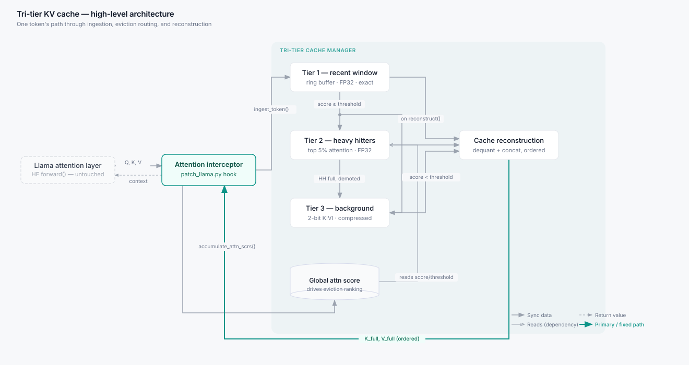

<div align="center">

# TriTierCache

**A hierarchical, memory-compressed KV cache for long-context LLM inference on consumer CPUs.**

[](https://www.python.org/)
[](https://pytorch.org/)
[](https://github.com/huggingface/transformers)
[](https://www.intel.com/)
[](LICENSE)

</div>

---

## The problem

Every token a language model generates is appended to a Key-Value cache. That cache grows linearly with context length and is read in full on every decoding step. At 32k context with a 32-head model, it is hundreds of megabytes of traffic per token. On a machine with a discrete datacenter GPU this is annoying. On a laptop with an integrated GPU and shared system RAM, it is the wall you hit first, long before compute becomes the limit.

The usual answers are to truncate old context, or to quantize the entire cache uniformly. Truncation loses information the model actually needs. Uniform quantization spends the same number of bits on a token nobody attends to as it does on the one the answer depends on.

## The idea

Not all cached tokens matter equally, so they should not all be stored at the same precision. TriTierCache sorts every token into one of four places and keeps precision where attention actually lands.

| Where the token lives | Precision | Who goes there |
| :--- | :--- | :--- |
| Attention sinks | Exact FP32 | The first 4 tokens of the sequence. Never evicted. They anchor the softmax distribution and keep generation stable over long runs. |
| Tier 1, recent window | Exact FP32 | The most recent 256 tokens, in a ring buffer. Local context is where most attention lands, so it stays lossless. |
| Tier 2, heavy hitters | Exact FP32 | Older tokens that keep attracting attention, tracked by a running attention score. Roughly the top 5 percent. |
| Tier 3, background store | 2-bit packed | Everything else. Quantized asymmetrically and packed 16 values to an int32. |

When a token falls out of the recent window, it is scored. High scorers are promoted into the heavy-hitter tier. The rest are staged in a 16-token waiting room, quantized in one batch, and written into the background store. Heavy hitters that go cold later get demoted into the background store too, so the tiers keep rebalancing as generation continues.

<div align="center">

<!-- High-level architecture -->


</div>

## Why it is fast, not just small

Compression usually costs speed, because something has to decompress the data before attention can read it. TriTierCache avoids that by never materializing a decompressed cache.

A native C++ extension (`tri_tier._C`) runs the whole decode step in one fused kernel. It streams the compressed tier one 16-token block at a time through a small scratch buffer that stays resident in L2, unpacks 2-bit values inline with AVX2, and folds them straight into the dot product. Peak scratch memory during attention is measured in kilobytes rather than the hundreds of megabytes a full reconstruction would need. Query heads are split across cores with OpenMP.

If the extension is not compiled, the package falls back to a pure PyTorch reference path. Same results, slower. This also doubles as the correctness oracle the C++ kernels are tested against.

## Results

Measured on `HuggingFaceTB/SmolLM-135M`, Linux x86_64, AVX2 + FMA + OpenMP. Baseline is Hugging Face `DynamicCache`.

| Category | Metric | Baseline | TriTierCache | Result |
| :--- | :--- | :--- | :--- | :--- |
| Kernel latency | Fused attention decode | 1050.00 µs/step | **373.79 µs/step** | 2.81x faster |
| Thread scaling | 1 thread to 8 threads | 978.04 µs | **274.46 µs** | 3.56x |
| Decode latency | Single token, 256 ctx | 41.25 ms/tok | **40.33 ms/tok** | 24.79 tok/s |
| Prefill (TTFT) | 128-token prompt | 149.53 ms | **183.24 ms** | 1.22x slower |
| Memory, 256 ctx | Active KV footprint | 5.62 MB | **5.62 MB** | parity |
| Memory, 32k ctx | Active KV footprint | 720.00 MB | **186.58 MB** | 3.86x smaller |
| Perplexity | 2048 context | 6.1001 | **7.7298** | +1.63 PPL |
| NIAH retrieval | Needle at 10/50/90 percent depth | 3/3 | **3/3** | exact |
| Token agreement | Top-1 greedy match | 100% | **100.00%** | exact parity |

Two things worth reading honestly. Prefill is currently slower than vanilla, because prompt ingestion has to route and quantize on the way in. And the memory win only appears once the context is long enough for the background tier to dominate; at 256 tokens everything still fits in the exact tiers, so the footprint is identical by design.

## Install

Requirements: Linux x86_64 with AVX2, FMA and BMI2; GCC 9 or newer with OpenMP; Python 3.10+; PyTorch 2.1+.

```bash
git clone https://github.com/RahulGPi/TriTierCache.git
cd TriTierCache

# Editable install, builds the C++ extension as part of the install
pip install -e .

# Verify the native extension loaded
python -c "import tri_tier._C as _C; print('extension ok:', _C.fused_attention_decode)"
```

Check your CPU has what the build needs:

```bash
lscpu | grep -o -E 'avx2|fma|bmi2' | sort -u
```

## Quickstart

### Patch a Hugging Face model

```python
import torch
from transformers import AutoModelForCausalLM, AutoTokenizer
from tri_tier.integration.patch_llama import apply_patch

apply_patch()

model_id = "meta-llama/Llama-3.2-1B"
tokenizer = AutoTokenizer.from_pretrained(model_id)
model = AutoModelForCausalLM.from_pretrained(
    model_id, torch_dtype=torch.float32, device_map="cpu"
)

inputs = tokenizer("The quick brown fox jumps over the lazy dog", return_tensors="pt")
with torch.no_grad():
    out = model.generate(**inputs, max_new_tokens=64, use_cache=True)

print(tokenizer.decode(out[0], skip_special_tokens=True))
```

### Use the cache directly

```python
import torch
from tri_tier import TriTierCache

cache = TriTierCache(
    max_seq_len=2048,
    head_dim=128,
    num_heads=32,      # must be num_key_value_heads for GQA models
    R_size=256,
    H_ratio=0.05,
)

k_new = torch.randn(32, 128)
v_new = torch.randn(32, 128)
cache.ingest_token(k_new, v_new)

k_full, v_full, full_ids = cache.reconstruct_full_cache()

attn = torch.randn(1, 32, 1, k_full.shape[0]).softmax(dim=-1)
cache.accumulate_attn_scrs(attn, full_ids)
```

### Side-by-side demo

```bash
PYTHONPATH=src python example.py \
  --model HuggingFaceTB/SmolLM-135M \
  --prompt-tokens 512 \
  --new-tokens 32
```

## Repository layout

```text
.
├── csrc/                       # C++ AVX2 / OpenMP extension sources
│   ├── bindings.cpp            # pybind11 module -> tri_tier._C
│   ├── cache_engine.cpp        # native cache state and ring buffer management
│   ├── cpu/                    # quantize, dequantize, fused attention kernels
│   └── include/                # kernel headers
├── src/tri_tier/               # Python package
│   ├── cache.py                # TriTierCache
│   ├── cli.py                  # command line entry point
│   ├── constants.py            # SINK_SIZE, CHUNK_SIZE, R_size defaults
│   └── integration/
│       └── patch_llama.py      # LLaMA attention monkey-patch and fallback path
├── benchmarks/                 # latency, memory, perplexity, NIAH, ablations
│   └── results/                # exported CSVs
├── tests/                      # pytest suite plus standalone C++ kernel tests
├── example.py                  # end-to-end comparison demo
├── smoke_test.py               # fast end-to-end sanity check
└── setup.py / pyproject.toml   # build configuration
```

Full internals, quantization math, kernel contracts and the native ABI are documented in [`src/README.md`](src/README.md).

## Benchmarks

```bash
# Everything, quick mode
PYTHONPATH=src python benchmarks/run_all_benchmarks.py --quick

# Individual suites
PYTHONPATH=src python benchmarks/benchmark_correctness.py
PYTHONPATH=src python benchmarks/benchmark_latency.py
PYTHONPATH=src python benchmarks/benchmark_memory.py
PYTHONPATH=src python benchmarks/benchmark_perplexity.py

# Tier ablation grid
PYTHONPATH=src python benchmarks/run_isolation_grid.py

# Formatted report from the CSVs in benchmarks/results/
PYTHONPATH=src python benchmarks/generate_report.py
```

Outputs land in `benchmarks/results/` as CSV, one file per suite (`latency_results.csv`, `memory_rss_results.csv`, `perplexity_results.csv`, `niah_results.csv`, `thread_scaling_results.csv`, `ablation_results.csv`, and others).

## Tests

```bash
PYTHONPATH=src pytest -v
```

The Python suite covers buffer sizing, tier routing, attention scoring and the LLaMA patch including GQA head mapping. C++ kernels have their own standalone harnesses under `tests/`, checked against numpy-generated ground truth. See the src README for how to regenerate those fixtures.

## Configuration

| Parameter | Default | Effect |
| :--- | :--- | :--- |
| `SINK_SIZE` | 4 | Pinned initial tokens. Raising it costs exact-tier memory and rarely helps. |
| `R_size` | 256 | Recent window size. The main quality lever. Larger means better local fidelity, more FP32 memory. |
| `H_ratio` | 0.05 | Fraction of `max_seq_len` kept as heavy hitters. |
| `CHUNK_SIZE` | 16 | Tokens per packed block. Fixed by the 2-bit-into-int32 packing layout. Do not change. |
| `max_seq_len` | model dependent | Sizes the global attention tracker and the heavy-hitter budget. |

## Model support

| Model family | Status | Notes |
| :--- | :--- | :--- |
| LLaMA 3 / 3.2 | Supported | GQA handled natively in the kernel |
| SmolLM | Supported | Primary benchmark target |
| Mistral | Not tested | Same attention shape, likely a small patch |
| Qwen | Not tested | |

## Roadmap

- Integer-domain attention using AVX-VNNI (`_mm256_dpbusd_epi32`), skipping FP32 reconstruction entirely
- Intel Xe-LP iGPU offload via DP4A under a zero-copy unified memory model
- Batch size greater than 1, and multi-token speculative decode
- Prefill path optimization to close the 1.22x TTFT gap
- Expose full per-head attention weights on the fused path

## License

Apache License 2.0. See [LICENSE](LICENSE).

## Acknowledgements

The tier design borrows from three lines of work: StreamingLLM for attention sinks, H2O for heavy-hitter eviction policy, and KIVI for asymmetric per-channel key and per-token value quantization. The routing between them, the packing layout and the fused CPU kernels are this project's own.
