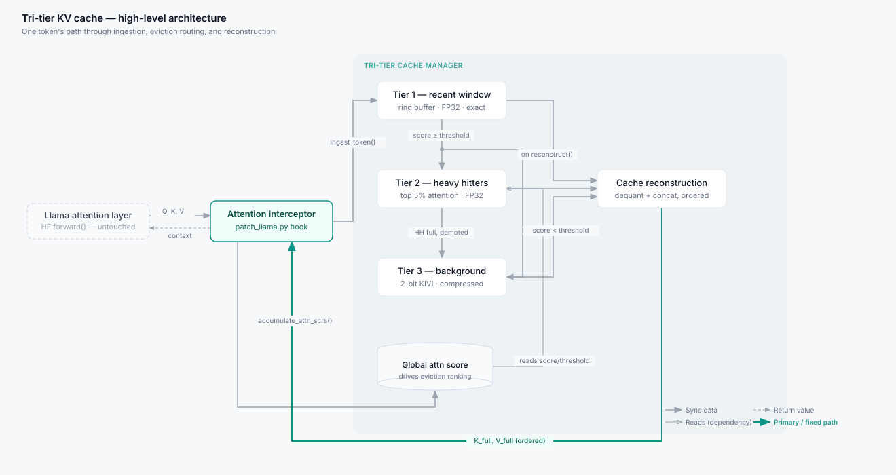
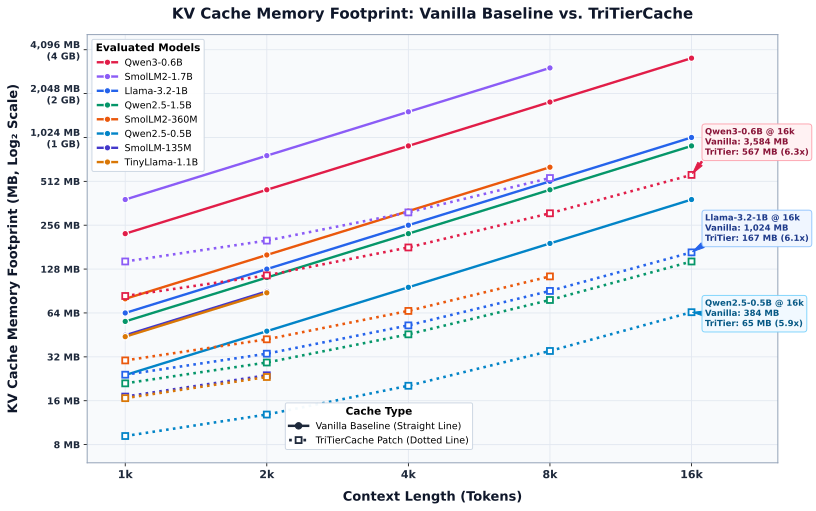

<div align="center">

# TriTierCache

**A hierarchical, memory-compressed KV cache for long-context LLM inference on consumer CPUs.**

[](https://pypi.org/project/tri-tier/)
[](https://www.python.org/)
[](https://pytorch.org/)
[](https://github.com/huggingface/transformers)
[](https://www.intel.com/)
[](LICENSE)

</div>

---

## The problem

Every token a language model generates is appended to a Key-Value cache. That cache grows linearly with context length and is read in full on every decoding step. At 32k context with a 32-head model, it is hundreds of megabytes of traffic per token. On a machine with a discrete datacenter GPU this is annoying. On a laptop with an integrated GPU and shared system RAM, it is the wall you hit first, long before compute becomes the limit.

The usual answers are to truncate old context, or to quantize the entire cache uniformly. Truncation loses information the model actually needs. Uniform quantization spends the same number of bits on a token nobody attends to as it does on the one the answer depends on.

## The idea

Not all cached tokens matter equally, so they should not all be stored at the same precision. TriTierCache sorts every token into one of four places and keeps precision where attention actually lands.

| Where the token lives | Precision | Who goes there |
| :--- | :--- | :--- |
| Attention sinks | Exact FP32 | The first 4 tokens of the sequence. Never evicted. They anchor the softmax distribution and keep generation stable over long runs. |
| Tier 1, recent window | Exact FP32 | The most recent 256 tokens, in a ring buffer. Local context is where most attention lands, so it stays lossless. |
| Tier 2, heavy hitters | Exact FP32 | Older tokens that keep attracting attention, tracked by a running attention score. Roughly the top 5 percent. |
| Tier 3, background store | 2-bit packed | Everything else. Quantized asymmetrically and packed 16 values to an int32. |

When a token falls out of the recent window, it is scored. High scorers are promoted into the heavy-hitter tier. The rest are staged in a 16-token waiting room, quantized in one batch, and written into the background store. Heavy hitters that go cold later get demoted into the background store too, so the tiers keep rebalancing as generation continues.

<div align="center">

<!-- High-level architecture -->


</div>

## Why it is fast, not just small

Compression usually costs speed, because something has to decompress the data before attention can read it. TriTierCache avoids that by never materializing a decompressed cache.

A native C++ extension (`tri_tier._C`) runs the whole decode step in one fused kernel. It streams the compressed tier one 16-token block at a time through a small scratch buffer that stays resident in L2, unpacks 2-bit values inline with AVX2, and folds them straight into the dot product. Peak scratch memory during attention is measured in kilobytes rather than the hundreds of megabytes a full reconstruction would need. Query heads are split across cores with OpenMP.

If the extension is not compiled, the package falls back to a pure PyTorch reference path. Same results, slower. This also doubles as the correctness oracle the C++ kernels are tested against.

## Results summary

TriTierCache delivers up to **6.3x memory reduction** and **2.81x faster decode attention** while maintaining >90% downstream task retention and zero loss on needle-in-a-haystack retrieval across long contexts.

<div align="center">

<a href="benchmarks_kv_memory.svg">
  
</a>

</div>

| Metric | Vanilla Baseline (FP32) | TriTierCache | Impact / Speedup |
| :--- | :--- | :--- | :--- |
| **Decode Latency** (fused AVX2) | 1,050.00 µs/step | **373.79 µs/step** | **2.81x faster** decode |
| **Thread Scaling** (1 $\to$ 8 OpenMP) | 978.04 µs | **274.46 µs** | **3.56x speedup** |
| **Memory Footprint** (8k context) | 512.0 MB | **109.0 MB** | **4.70x compression** vs FP32 (2.35x vs FP16) |
| **Memory Footprint** (32k context) | 2,048.0 MB | **394.1 MB** | **5.20x–7.10x compression** vs FP32 (2.60x–3.55x vs FP16) |
| **Downstream Accuracy** (8k–16k) | 100.0% | **93.3%–100.0%** | Retained across QA, Variable Tracking, Many-Shot ICL |
| **Needle Retrieval (NIAH)** (8k–16k) | 100.0% (27/27) | **100.0% (54/54)** | Flawless 100% retrieval up to $2.0\times$ base context |
| **Canonical Perplexity** (1024 tokens) | 7.2107 ± 2.9186 | **7.2235 ± 2.9183** | **+0.0128 PPL** delta (<0.2% change) |

> 📊 **Detailed Benchmarks & Comprehensive Evaluation Suite:**
> For complete per-model evaluation tables, graduated NIAH sweeps, canonical perplexity evaluations, physical memory RSS accounting, and reproduction scripts, see [`benchmarks/README.md`](benchmarks/README.md).


## Install

### From PyPI

```bash
pip install tri-tier
```

For running comprehensive benchmarks and evaluation suites:
```bash
pip install "tri-tier[benchmark]"
```

Verify your installation and CPU acceleration support:
```bash
tri-tier --check
```

### From Source

Requirements: Linux x86_64 with AVX2, FMA and BMI2; GCC 9 or newer with OpenMP; Python 3.10+; PyTorch 2.1+.

```bash
git clone https://github.com/RahulGPi/TriTierCache.git
cd TriTierCache

# Editable install (compiles C++ extension with AVX2 & OpenMP)
pip install -e .

# Verify the native extension and system compatibility
tri-tier --check
```

## Quickstart

### Patch a Hugging Face model

```python
import torch
from transformers import AutoModelForCausalLM, AutoTokenizer
from tri_tier.integration.patch_model import apply_patch

# Universal patch for LLaMA, Mistral, and Qwen architectures
apply_patch()

model_id = "meta-llama/Llama-3.2-1B"
tokenizer = AutoTokenizer.from_pretrained(model_id)
model = AutoModelForCausalLM.from_pretrained(
    model_id, torch_dtype=torch.float32, device_map="cpu"
)

inputs = tokenizer("The quick brown fox jumps over the lazy dog", return_tensors="pt")
with torch.no_grad():
    out = model.generate(**inputs, max_new_tokens=64, use_cache=True)

print(tokenizer.decode(out[0], skip_special_tokens=True))
```

### Use the cache directly

```python
import torch
from tri_tier import TriTierCache

cache = TriTierCache(
    max_seq_len=2048,
    head_dim=128,
    num_heads=32,      # must be num_key_value_heads for GQA models
    R_size=256,
    H_ratio=0.05,
)

k_new = torch.randn(32, 128)
v_new = torch.randn(32, 128)
cache.ingest_token(k_new, v_new)

k_full, v_full, full_ids = cache.reconstruct_full_cache()

attn = torch.randn(1, 32, 1, k_full.shape[0]).softmax(dim=-1)
cache.accumulate_attn_scrs(attn, full_ids)
```

### Side-by-side demo

```bash
PYTHONPATH=src python example.py \
  --model HuggingFaceTB/SmolLM-135M \
  --prompt-tokens 512 \
  --new-tokens 32
```

## Repository layout

```text
.
├── csrc/                       # C++ AVX2 / OpenMP extension sources
│   ├── bindings.cpp            # pybind11 module -> tri_tier._C
│   ├── cache_engine.cpp        # native cache state and ring buffer management
│   ├── cpu/                    # quantize, dequantize, fused attention kernels
│   └── include/                # kernel headers
├── src/tri_tier/               # Python package
│   ├── cache.py                # TriTierCache core implementation
│   ├── cli.py                  # command line entry point
│   ├── constants.py            # SINK_SIZE, CHUNK_SIZE, R_size defaults
│   └── integration/
│       ├── patch_llama.py      # LLaMA-specific attention monkey-patch
│       └── patch_model.py      # Universal multi-model monkey-patch (LLaMA, Mistral, Qwen)
├── benchmarks/                 # latency, memory, perplexity, NIAH, downstream accuracy
│   ├── README.md               # Complete benchmark data, tables, sweeps & reproduction guides
│   └── results/                # exported CSVs
├── tests/                      # pytest suite plus standalone C++ kernel tests
├── example.py                  # end-to-end comparison demo
├── smoke_test.py               # fast end-to-end sanity check
└── setup.py / pyproject.toml   # build configuration
```

- **Internals & Architecture Reference**: Full buffer layouts, quantization math, AVX2 kernel contracts, C++ ABI, and configuration parameter documentation are in [`src/README.md`](src/README.md).
- **Benchmark Suite & Results**: Comprehensive task accuracy tables, graduated NIAH sweeps, canonical perplexity, and memory accounting are in [`benchmarks/README.md`](benchmarks/README.md).

## Benchmarks

```bash
# Run full benchmark suite (quick mode)
PYTHONPATH=. python benchmarks/run_all_benchmarks.py --quick

# Run downstream long-context task accuracy suite
PYTHONPATH=. python benchmarks/benchmark_accuracy.py --models SmolLM-135M TinyLlama-1.1B-Chat-v1.0 SmolLM2-360M SmolLM2-1.7B Qwen2.5-0.5B-Instruct Qwen2.5-1.5B-Instruct Qwen3-0.6B Llama-3.2-1B --update-readme
```

Outputs land in `benchmarks/results/` as CSV. For detailed benchmark results and execution flags, see [`benchmarks/README.md`](benchmarks/README.md).

## Tests

```bash
PYTHONPATH=. pytest -v
```

The Python suite covers buffer sizing, tier routing, score accumulation, and multi-model patching across LLaMA, Mistral, and Qwen. Standalone C++ kernel tests are located under `tests/`.

## Configuration

All cache tuning parameters (`SINK_SIZE`, `R_size`, `H_ratio`, `CHUNK_SIZE`, `max_seq_len`, `K_GROUP_SIZE`, `PBS_METADATA_DTYPE`, `ROPE_MODE`, `score_decay`) are documented with recommended options and performance tradeoffs in the [Configuration Reference in `src/README.md`](src/README.md#11-configuration-parameters).

## Model support

| Model family | Status | Notes |
| :--- | :--- | :--- |
| LLaMA 3 / 3.1 / 3.2 | Supported | GQA handled natively in kernel (`head_dim=64, 128`), context to 131k |
| SmolLM / SmolLM2 | Supported | Primary benchmark targets (`head_dim=64`), MHA & GQA |
| TinyLlama | Supported | LLaMA GQA architecture (`head_dim=64`) |
| Qwen 2 / 2.5 / 3 | Supported | Qwen GQA architecture (`head_dim=64, 128`), per-head Q-K RMSNorm (Qwen 3), context 32k+ |
| Mistral / Mistral-Instruct | Supported | Mistral GQA architecture (`head_dim=128`), context to 32k+ |

Architectural patch and integration layer details are documented in [`src/README.md#10-integration-layer--multi-model-patching`](src/README.md#10-integration-layer--multi-model-patching).

## Roadmap

- Integer-domain attention using AVX-VNNI (`_mm256_dpbusd_epi32`), skipping FP32 reconstruction entirely
- Intel Xe-LP iGPU offload via DP4A under a zero-copy unified memory model
- Batch size greater than 1, and multi-token speculative decode
- Prefill path optimization to close the 1.22x TTFT gap
- Expose full per-head attention weights on the fused path

## License

MIT License. See [LICENSE](LICENSE).

## Acknowledgements

The tier design borrows from three lines of work: StreamingLLM for attention sinks, H2O for heavy-hitter eviction policy, and KIVI for asymmetric per-channel key and per-token value quantization. The routing between them, the packing layout and the fused CPU kernels are this project's own.
